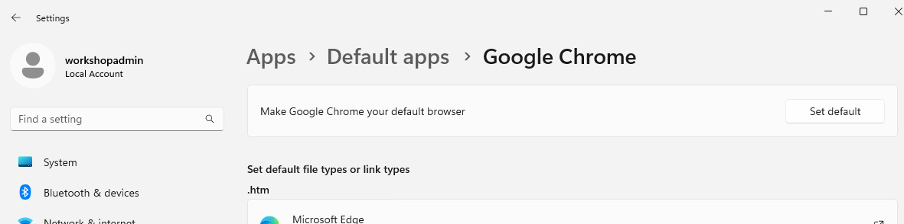
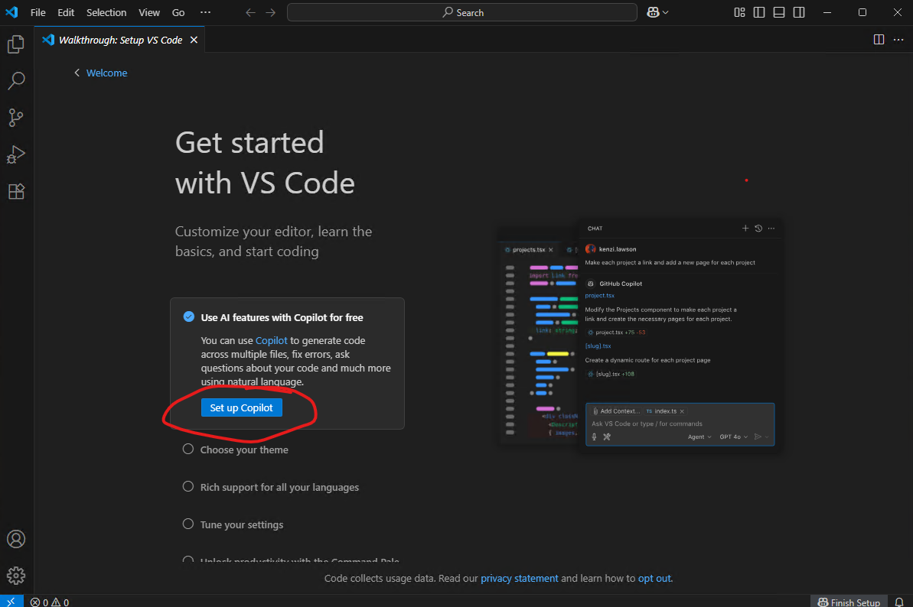

# Exercise 1.1: Setup the environment

## Learning Objectives

The goal of this exercise is to set up the development environment for the workshop exercises. This includes connecting to a workshop VM, or configuring your local environment.

## Overview

To provide a consistent development environment for all participants, we will use a pre-configured virtual machine (VM) hosted in Azure. This VM will have all the necessary tools and software installed to complete the workshop exercises.

If you prefer, you *can* use your own local environment. In this case, you will need to install the required software and configure your environment to match the workshop VM as closely as possible. However, we will not be able to provide support for issues that arise from using a local environment.

## Prerequisites

Using the remote VM:
- Microsoft Remote Desktop and the ability to connect to an external VM over the standard RDP port (3389)
- A GitHub Copilot subscription

Using your local machine:
- The latest version of Visual Studio Code
- .NET 9 SDK (dotnet CLI)
- Node.js (latest LTS version)
- A GitHub Copilot subscription

## Exercise Steps

### Step 1: Connect to the Remote VM

1. Open MS Remote Desktop (Start > Search > Remote Desktop)

1. In the Computer field enter the IP address of the remote VM assigned to you

1. Click 'Show Options'

1. In the 'User name' field enter 'workshopadmin'

1. Click 'Connect'

1. When prompted, enter the password provided by the instructor

1. Click 'Yes' to accept the unknown certificate

1. Note that the remote VM may take a few moments to initialize after you log in.

1. Click 'Accept' to accept the privacy settings.

1. Open Google Chrome and navigate back to these instructions (https://github.com/ConnectiveConsulting/ai-workshop) so you can stay within the browser. **Do not use Microsoft Edge** as Edge requires you to log into a Microsoft account.

1. When opening Chrome for the first time click 'Don't sign in' to bypass loading a profile.

1. Click the 'Set as default browser' button to open up settings.

1. Click the 'Set default' button next to 'Make Google Chrome your default browser'.

### Step 2: Log into GitHub Copilot

1. Open Visual Studio Code from the desktop shortcut
    - Note we are using Visual Studio *Code*, not full Visual Studio. GitHub Copilot in Visual Studio Code tends to get the latest features before all other IDEs.

1. You can close the Windows Subsystem for Linux notification if it is open, or let it close automatically after 60 seconds.

1. Click the 'Set up Copilot' button on the welcome screen

1. Click 'Continue with GitHub'

1. Log in using your GitHub account that has a Copilot subscription

1. Click 'Continue' and 'Authorize Visual-Studio-Code'

1. Click 'Open Visual Studio Code' when prompted

## Summary

You should now have a fully functional development environment set up for the workshop.

The repository with the exercises has already been cloned to your machine in the C:\Workshop folder.

---

[Next - GitHub Copilot Basics](../2.1-copilot-basics/README.md)

