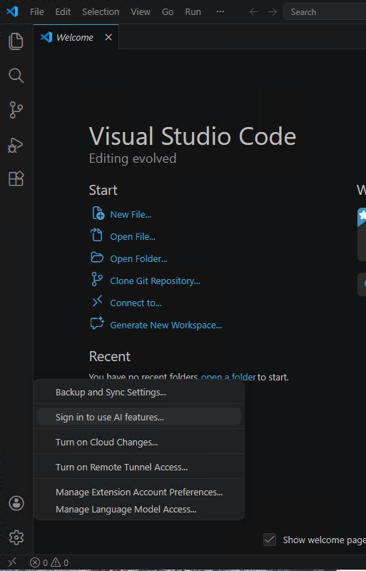
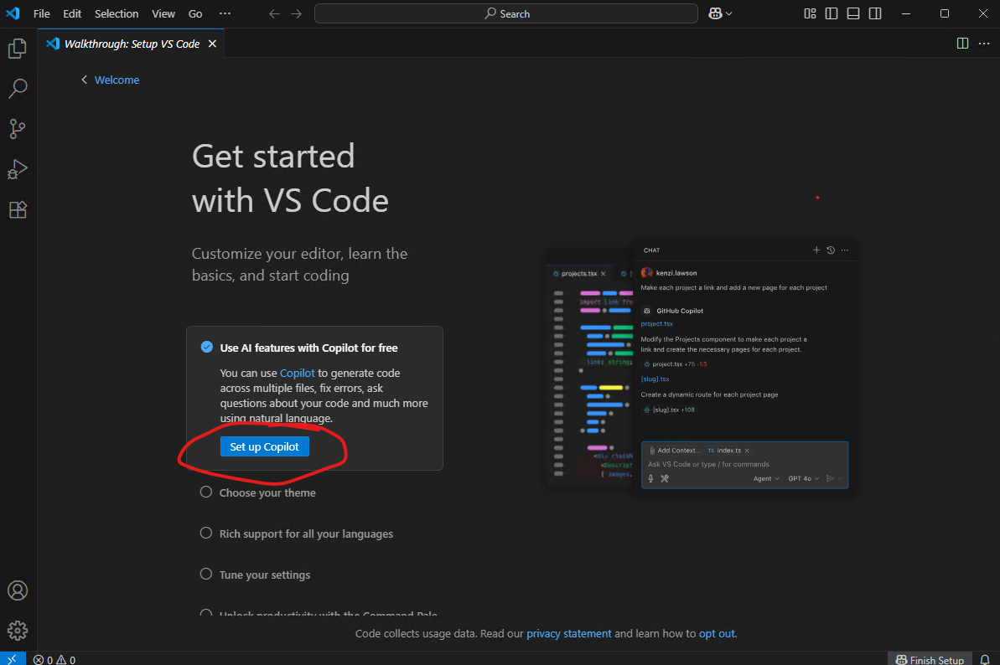

# Exercise 1.1: Setup the environment

## Learning Objectives

The goal of this exercise is to set up the development environment for the workshop exercises. This includes connecting to a workshop VM, or configuring your local environment.

## Overview

To provide a consistent development environment for all participants, we will use a pre-configured virtual machine (VM) hosted in Azure. This VM will have all the necessary tools and software installed to complete the workshop exercises.

If you prefer, you *can* use your own local environment. In this case, you will need to install the required software and configure your environment to match the workshop VM as closely as possible. However, we will not be able to provide support for issues that arise from using a local environment. *If you have not already set up your local environment, please use the remote VM option*.

## Prerequisites

Using the remote VM:
- **Microsoft Remote Desktop** and the ability to connect to an external VM over the standard RDP port (3389)
- An active **GitHub Copilot subscription**

Using your local machine:
- Installed software:
    - **Visual Studio Code** (latest version) with the **GitHub Copilot Chat extension** installed
    - **GitHub CLI** (latest version)
    - **Node.js** version 20 LTS or later
    - **Java 21** (LTS)
    - **Maven** (latest version)
- Ability to **clone a public repository from github.com** (i.e., no firewall or proxy blocking GitHub)
- An active **GitHub Copilot subscription**

Using DevContainers:
- Installed software:
    - **Visual Studio Code** (latest version) with the **GitHub Copilot Chat extension** installed
    - **Docker Desktop** (latest version)

## Exercise Steps - Remote VM

### Step 1: Connect to the Remote VM

> Note - if you have a .rdp file from the instructor you can skip steps 2-5

1. Open MS Remote Desktop (Start > Search > Remote Desktop)

1. In the Computer field enter the IP address or name of the remote VM assigned to you.

1. Click 'Show Options'

1. In the 'User name' field enter 'workshopadmin'

1. Click 'Connect'

1. When prompted, enter the password provided by the instructor

1. Click 'Yes' to accept the unknown certificate

1. Note that the remote VM may take a few moments to initialize after you log in, and may be slow at first.

1. Open Internet Explorer and navigate back to these instructions (https://github.com/ConnectiveConsulting/ai-workshop) so you can stay within the browser.

1. Keep this browser window open to follow along with the exercise instructions.

### Step 2: Log into GitHub Copilot in VS Code

1. Open Visual Studio Code from the desktop shortcut
    - Note we are using Visual Studio *Code*, not full Visual Studio. GitHub Copilot in Visual Studio Code tends to get the latest features before all other IDEs.

1. Click the 'Accounts' icon in the lower left and select "Sign in to use AI features..."


1. Click 'Continue with GitHub'

1. Log in using your GitHub account that has a Copilot subscription

1. Click 'Continue' and 'Authorize Visual-Studio-Code'

1. Click 'Open Visual Studio Code' when prompted

### Step 3: Open GitHub Copilot CLI

1. Open up a terminal and change to the `c:\workshop\project` folder, or use the terminal shortcut ("AI Workshop Project Terminal") on the desktop

1. Run `copilot` from the terminal

1. Answer "yes" to the "Do you trust the files in this folder?" question

1. When asked if you would like to set up the terminal for multi-line input support ("Would you like to add this key binding to your terminal configuration?"), answer Yes

1. Type in `/login` and hit enter

1. Select "1. GitHub.com" when asked "What account do you want to log into"

1. Ctrl-Click to open the URL provided, or go to https://github.com/login/device

1. Enter the provided code and agree to granting access to Copilot CLI

1. Type in `/clear` and hit enter to start a new session

1. Leave this window open for future exercises

### Complete!

You should now be connected to the remote VM and have GitHub Copilot set up and ready to use in Visual Studio Code.

The repositories for the course are cloned in the `C:\Workshop` directory on the remote VM, so you can navigate there in Visual Studio Code to access the exercises.

## Exercise Steps - Local Environment

### Step 1: Install Required Software

Either install the required software by following the instructions below, or verify that you have the required software already installed and configured.

#### Install by hand

1. Install **Visual Studio Code** from https://code.visualstudio.com/

1. Install the **GitHub Copilot Chat extension** from the Visual Studio Code marketplace

1. Install **GitHub CLI** from https://cli.github.com/

1. Install **Node.js** version 20 LTS or later from https://nodejs.org/

1. Install **Java 21** (LTS) from https://www.oracle.com/java/technologies/downloads/#java21

1. Install **Maven** from https://maven.apache.org/download.cgi

### Step 2: Log into GitHub Copilot

1. Open Visual Studio Code
    - Note we are using Visual Studio *Code*, not full Visual Studio. GitHub Copilot in Visual Studio Code tends to get the latest features before all other IDEs.

1. Click the 'Set up Copilot' button on the welcome screen



1. Click 'Continue with GitHub'

1. Log in using your GitHub account that has a Copilot subscription

1. Click 'Continue' and 'Authorize Visual-Studio-Code'

1. Click 'Open Visual Studio Code' when prompted

### Step 3: Clone the Workshop Repositories

1. Open a terminal in Visual Studio Code (Ctrl+`)

1. Navigate to the folder where you want to clone the repositories (e.g., `cd C:\Workshop`)

1. Clone the exercises repository
    ```bash
    git clone https://github.com/ConnectiveConsulting/ai-workshop-project.git
    ```

1. Navigate into the cloned repository and create a personal branch
    ```bash
    cd ai-workshop-project
    git checkout -b user/[your-name-here]
    ```

### Step 4: (Optional) Open the project in a devcontainer

1. If you have Docker Desktop installed, you can open the project in a devcontainer for a fully pre-configured development environment.

1. In Visual Studio Code, click the green '><' icon in the bottom left corner and select 'Reopen in Container'
OR
1. Open the command palette (Ctrl+Shift+P) and select 'Dev Containers: Reopen in Container'

1. Wait for the devcontainer to build and start. This may take several minutes the first time as it needs to build a Docker image with all the necessary tools installed.

## Summary

You should now have a fully functional development environment set up for the workshop.

---

[Next: Project Exploration](../1.2-project-exploration/README.md)

