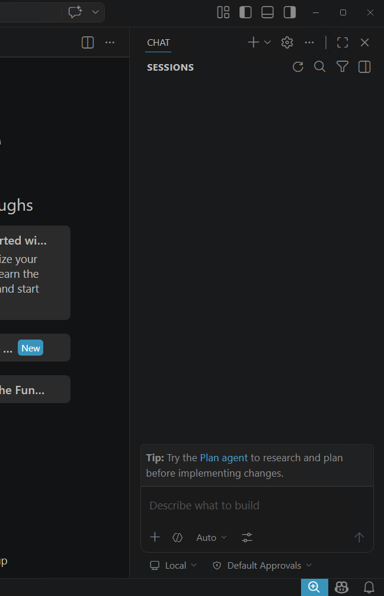

# Exercise 1.2: Project Exploration — Think AI First

## Learning Objectives

- Get the workshop project set up and running on your machine
- Use Copilot Agent mode to understand, document, and run an unfamiliar codebase
- Begin building the habit of reaching for AI *first* when approaching new code
- Use the `/explain` command and **Ask** mode to explore and understand unfamiliar code

## Overview

Throughout this course, we'll be working with a shared example project — a **Training Management** application built with a Spring Boot backend and a React frontend. It's not the most exciting app in the world, but hey, at least it's not another to-do list.

In a *normal* course, we'd give you a nice walkthrough of the architecture, how it's built, how to run it, etc. But that's not thinking AI first. Instead, we're going to let Copilot figure all of that out for us.

## Exercise Steps

### Step 1: Open the Project

1. If you are on a **remote lab machine**, the project has already been cloned for you at `C:\Workshop\project`. Skip to step 3.

1. If you are on your **local machine**, open a terminal and clone the repository (if you haven't already):

    ```bash
    git clone https://github.com/ConnectiveConsulting/ai-workshop-project.git
    ```

1. Open the project folder in **Visual Studio Code** via File > Open Folder (or `code .` from the terminal).

1. Select `Yes, I trust the authors` if prompted about trusting the workspace.

### Step 2: Let Copilot Learn the Project

Normally, the first thing you'd do with a new codebase is poke around the folder structure, look for a README, maybe find a Makefile or `docker-compose.yml` and start guessing. We're going to skip all of that and let the AI do the reconnaissance.

1. Open the **Copilot Chat** panel (click the Copilot icon in the sidebar, or press `Ctrl+Alt+I`).



1. Make sure you are in **Agent** mode. Look at the mode selector dropdown at the bottom of the chat input — it should say **Agent**. If it says "Ask" or "Edit," switch it to **Agent**.

1. Type the following command and press Enter:

    ```
    /init
    ```

1. Copilot will begin scanning the entire project. What it's doing is writing a `AGENTS.md` file — think of it like a `README.md`, but for the AI. It contains instructions and context that the agent will reference with every future prompt. We'll get into customizing this more in a later exercise, but for now, just let it do its thing.

1. **Be patient.** The agent is reading the entire project — every file, every folder — and building a holistic understanding of the codebase. Watch the output as it works. You'll see it reading files, analyzing structure, and summarizing what it finds. This is a great peek behind the curtain at how agents think.

1. When it finishes, click the `Keep` button to accept the changes. Open the generated `AGENTS.md` file and review it. Pretty cool, right? The agent just wrote itself a cheat sheet for your entire project.

### Step 3: Generate a Developer README

Now let's put the agent to work on something practical. We need documentation that would help a new developer get up and running.

1. In the Copilot Chat panel (still in **Agent** mode using the same session), enter a prompt like:

    ```
    Generate a README.md for this project aimed at developers. Focus on a quick-start guide:
    what the project does, how to build it, how to run it, and any prerequisites.
    ```

1. Let the agent generate the file. Review what it produces — how does it differ from the AGENTS.md? For now they are likely very similar, but as we customize the AGENTS.md in later exercises, you'll see the README become more user-focused while the AGENTS.md becomes more of an internal document for the AI.

### Step 4: Commit Your Changes (Let the Agent Write the Message)

You've got two shiny new files thanks to the agent — `AGENTS.md` and a fresh developer `README.md`. Let's lock those in before we move on. But we're **AI first**, so we're not going to stop and craft a commit message ourselves. We're going to let the agent do it.

1. Have Copilot switch to a new branch and commit. We'll name the branch with your name to not conflict with others in the class. In the Copilot Chat panel (still in **Agent** mode), enter a prompt like:

    ```
    Commit the changes in this session to a new user-specific git branch named after me ([your-name-here]) with an appropriate commit message.
    ```

1. Copilot will ask for permission to run git commands. By default, agents are sandboxed and can't make changes to your code or run commands without explicit permission. This is a safety feature to prevent unwanted changes. But in this case, we want to give the agent permission to commit for us. Click on the arrow next to the prompt and select `Enable Auto-Approve...` and accept the prompt. Over this course we will be giving the agent more and more permissions, so this is the first step in that process.

1. For subsequent git actions you can select `Allow` or click the down arrow to select `Always Allow` for specific commands. This is a great time to start thinking about what permissions you want to give your agent. Do you want it to be able to commit code on your behalf? Do you want it to be able to run any terminal command, or only specific ones?

1. Watch what happens. The agent will check the repository state (running `git status` and `git diff`), then write a commit message **based on what it actually did for you in this session** — it already has the full context of what changed and why. No need for you to summarize anything.

1. **Read the commit message it generated.** Notice how specific it is — it's not a lazy "updated docs." It calls out the new `AGENTS.md` and the developer README because the agent was *there* when those files were created. This is one of those small wins that adds up fast: the session context becomes the commit context, for free.

### Step 5: Run the Project (AI First!)

Now here's the fun part. We *could* read that README we just generated and follow the instructions manually. But we're **AI first**, remember?

1. Start a new chat session in Copilot (click the `+` icon at the top of the chat panel or hit Ctrl-N).

1. In the Copilot Chat panel, enter a prompt like:

    ```
    Start up the project - both the backend and frontend. When it's running, tell me the URL to open the frontend in my browser.
    ```

1. Watch as the agent figures out how to build and launch both parts of the application. It will run terminal commands, monitor the output, and tell you when things are ready.

    > **Note:** If your machine is missing a required tool (like Node.js, Java, or Maven), the agent will probably notice and try to install it or fix the issue. This is interesting to watch, but can be a rabbit hole. If you see the agent struggling with environment setup for more than a couple of minutes, let an instructor know so we don't burn too much time troubleshooting your local setup.

    > **Also Note:** You may get a Windows firewall prompt when the backend starts up to allow the JDK to communicate on the network. This is because the agent is running the backend server on your machine, and it needs permission to allow that network traffic. Be sure to click "Allow access" so that the agent can confirm when the backend is up and running.

1. Once the agent reports that the app is running, open the frontend URL it gives you in your browser (it's typically `http://localhost:5173`).

1. Click the **"Seed Sample Data"** button to populate the app with some example courses and registrations.

1. Spend a few minutes exploring the UI. Browse the course list, view course details, try registering for a course, and poke around the admin section at `/admin`. Get a feel for what this app does — you'll be working with it for the rest of the workshop.

### Step 6: Quick Code Explanations with /explain

Now that you've seen the app running, let's dig into the code. Copilot has a handy shortcut for when you're staring at a block of code and thinking "...what?" — the `/explain` command. It works right in the editor without needing to describe what you're looking at.

1. Open a **new chat** in Copilot (click the `+` icon at the top of the chat panel or hit Ctrl-N).

1. In the VS Code explorer, open `frontend/src/pages/CourseDetail.jsx`.

1. Select lines 20–39 — this is the `useEffect` block that uses `Promise.all` to fetch course data and registrations in parallel. There's a lot going on here if you're not used to React.

1. With that code selected, type the following in the Copilot Chat panel and press Enter:

    ```
    /explain
    ```

    Notice that above the chat entry textbox it says "CourseDetail.jsx:20-39. Copilot automatically added the selected code to its context and walk you through what it does. No need to copy-paste or describe the code yourself.

1. Now try it with some backend code. Open `backend/src/main/java/.../registration/RegistrationService.java` and select the `register` method (the block that checks capacity and creates a registration). Run `/explain` again.

1. Try `/explain` on a few more areas that catch your eye. It's a quick way to get your bearings in unfamiliar code without leaving the editor.

### Step 7: Deep Dive with Ask Mode

`/explain` is great for quick "what does this do?" moments, but sometimes you want to have a *conversation* about the code — ask follow-up questions, explore design decisions, or understand the "why" behind a pattern. That's where **Ask** mode shines.

1. Switch from **Agent** mode to **Ask** mode using the mode selector dropdown at the bottom of the chat input. Ask mode is a good choice here because we want to ask questions about the code without the agent making any changes.

1. This is your chance to explore. We'd encourage you to look at the parts of the codebase you'd be **least** familiar with:

    - **If you haven't done much frontend React work**, dig into the React side. There's some interesting stuff in there — `useEffect` with dependency arrays, `Promise.all` for parallel API calls, a single form component that handles both create and edit operations, and Vite's dev server proxy configuration.
    
    - **If you're less familiar with Spring Boot**, look at the backend. You'll find patterns like constructor-based dependency injection, JPA repository conventions (including the underscore syntax in `findByCourse_Id`), `@JsonIgnore` to prevent circular JSON references, and `FetchType.LAZY` for relationship loading.

1. Ask Copilot to explain things — and follow up! Unlike `/explain`, here you can have a back-and-forth conversation. Some ideas to get you started:

    ```
    What does the empty array [] in the useEffect call in CourseList.jsx do?
    Why would it matter if I forgot it?
    ```

    ```
    In Registration.java, why is the course field annotated with @JsonIgnore
    but there's still a getCourseId() method? What problem does this solve?
    ```

    ```
    How does Vite's proxy configuration in vite.config.js work?
    Why is it needed during development?
    ```

    ```
    Explain the capacity-checking logic in RegistrationService.java.
    What happens if two people try to register for the last seat at the same time?
    ```

1. **Not sure where to start?** Ask the agent! Try something like:

    ```
    I'm a Java developer but I haven't worked with React before.
    What are the most interesting or unusual patterns in the frontend
    code that I should understand?
    ```

    Or even:

    ```
    Interview me about my development background and then suggest
    the most educational parts of this codebase for me to explore.
    ```

    Using AI for customized learning is an excellent way to quickly get up to speed on unfamiliar technologies or codebases. The agent can tailor its responses based on your experience level and interests.

### Step 8: Clean Up

When you're done exploring, let's shut things down.

1. Switch back to the chat session where you started the project (or open a new one in **Agent** mode).

1. Tell the agent to stop everything:

    ```
    Stop the frontend and backend processes that are running.
    ```

1. Verify that both processes have been terminated.

## Summary

Take a step back and think about what just happened. You just:

- Had an AI agent analyze and document an entire codebase for you
- Generated developer onboarding documentation in seconds
- Committed your work without writing the commit message yourself — the agent wrote it from session context
- Let the agent build and launch a full-stack application without reading a single README yourself
- Used `/explain` for quick, in-context code explanations without leaving the editor
- Switched to **Ask** mode for deeper, conversational exploration of unfamiliar code patterns

**Think about this:**

- **How is this different from how you'd normally approach a new project?** Before AI, you'd probably spend the first hour (or day) reading docs, guessing at build commands, and grepping through code. The agent just cut that to minutes.

- **What if this were a legacy codebase with no documentation?** Imagine inheriting a 10-year-old monolith with zero READMEs. That `/init` command suddenly looks a lot more valuable, doesn't it?

- **Did the AI fail anywhere along the way?** Maybe it got a build command wrong, or described something inaccurately. Did it catch its own mistakes? Did you have to step in and correct it? This is an important thing to start noticing — the AI is powerful, but it's not infallible. You're still the pilot.

---

[Next: Copilot Customization](../5.2-copilot-customization)
