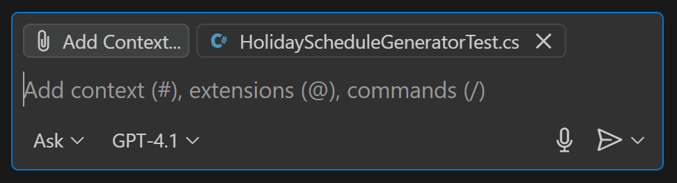

# Exercise 2.1: Generating Unit Tests with GitHub Copilot

## Learning Objectives

- Learn how to use GitHub Copilot to generate unit tests
- Explore how GitHub Copilot can assist in defining test cases

## Overview

In this exercise, you will learn how to use GitHub Copilot to generate unit tests for your code. By providing context and examples, you can help Copilot understand your testing needs and generate relevant test cases.

## Exercise Steps

### Step 1. Open and explore the project

1. In Visual Studio Code go to File > Open Folder and select the c:\Workshop\projects\HolidayGenerator folder.
    
    > NOTE: Do not simply open the root of the repository at c:\Workshop and navigate between folders within the VS Code explorer. GitHub Copilot may get confused about the scope of the project for some exercises.

1. Explore the files in the HolidayGenerator.Console folder and familiarize yourself with the project.

    > This project is a simple holiday schedule generator. Given a list of holidays and a year, it generates a schedule of holiday dates for that year (e.g. Thanksgiving falls on the fourth Thursday of November, which is Nov 27th in 2025).

1. Open the terminal in Visual Studio Code using ``Ctrl + ` `` or by selecting "View" > "Terminal" from the top menu.

1. Build and run the project with the ``dotnet`` runtime:
    ```powershell
    dotnet run
    ```

1. Enter some years to see how the application functions.

1. Stop the application by pressing Enter without typing in a year.

### Step 2. Generate tests

1. Open the HolidaySchedulerGenerator.cs file.

1. Click on the ``public class HolidayScheduleGenerator`` declaration to place your cursor there.

1. Press ``Ctrl + \`` to bring up the inline Copilot editor inline chat.

1. Type ``/tests`` and hit ``Enter`` to initiate a test generation request for the class.

    > The /tests command is a short-cut that can be used in place of a "Write tests for this class" prompt.

1. Once Copilot is done generating the test class click ``Accept`` to keep the changes.

1. Hit ``Ctrl + S`` to save the changes. Save the file in the HolidayGenerator.Tests project folder (C:\Workshop\projects\HolidayGenerator\HolidayGenerator.Tests) and name it after the class name (Copilot will likely name it "HolidayScheduleGeneratorTest").

1. Because we used the inline chat feature and saved the file to a different project, there's a chance there are compiler errors because Copilot only looked at the current file and didn't pull other files into its context. For any errors you see click on the lightbulb icon that appears next to the line number and click the ``Fix`` menu item. Click accept for the suggested fixes.

1. In the terminal switch to the tests project folder

    ```
    cd ../HolidayGenerator.Tests
    ```

1. Run the tests to make sure they pass

    ```
    dotnet test
    ```

1. Review the tests. Do you see any edge cases Copilot may have missed? Are there tests in here that surprise you that you wouldn't have thought to write?

### Step 3. Explore edge cases

1. Think about potential edge cases that could break the holiday schedule generator. For example, what happens if the input year is a leap year? What if holidays fall on the same date?

1. In the Copilot chat window make sure we are in ``Ask`` mode and the model is ``GPT4.1``. Make sure the tests file (e.g. HolidayScheduleGeneratorTests.cs) is the active window, then click on the name of the file next to the ``Add Context`` button above the Copilot prompt entry to make sure the test file is part of the context.

    

1. Enter the following prompt

    > Are there any other date specific edge cases for the HolidayScheduleGenerator class you can think for that need to be added to these unit tests? Explore all possibilities that are not already accounted for and list them.

1. Read these over the response. There's a good chance Copilot came up with a list of more edge cases (leap years, boundary cases, etc).

1. Switch Copilot to ``Agent`` mode and enter the following prompt

    > Please implement unit tests for the edge cases identified in the previous step.

1. Review the full test suite to ensure all edge cases are covered.

## Summary

GitHub Copilot can be very useful for not just generating code, but also for understanding and implementing testing strategies.

Copilot can generate your basic happy-path tests, and often uncover edge cases you may not have thought of.

---

[Next: Copilot Basics - Prompts & Context](../2.2-copilot-context/README.md)