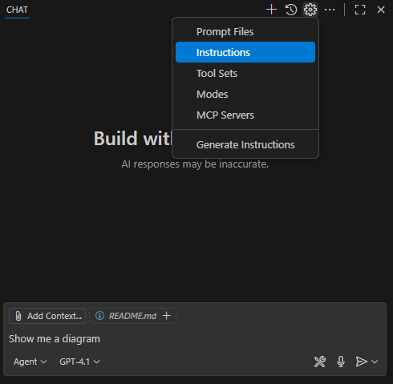

# Exercise 4.1: Customizing GitHub Copilot with Instructions

## Learning Objectives

- Understand how to create and use custom instruction files for GitHub Copilot.

## Overview

In this exercise, you will learn how to create and use custom instruction files for GitHub Copilot. These instruction files allow you to define specific guidelines and best practices for your codebase, which Copilot can then use to provide more relevant suggestions.

## Exercise Steps

### Step 1. Create custom instructions for *.cs and *.js files

1. Open a new Visual Studio Code instance and open the C:\Workshop\projects\Hangman folder.

1. Briefly review the code. Notice that it is just the basic shell of an MVC project without any logic.

1. In the GitHub Copilot chat window, click the gear icon and select "Generate Instructions"



1. Select "New instruction file..."

1. Select the default ".github/instructions" location for the file.

1. Enter "csharp-style" for the instruction name

1. Copy the following instructions into the csharp-style.instructions.md file and save it:
    ```
    ---
    applyTo: '**/*.cs'
    ---

    # C# Style Guide
    - Use consistent naming conventions.
    - Keep methods short and focused on a single task.
    - Use XML comments for public APIs.
    - All comments should be written in pirate speak. Arr matey!
    ```

    > Take note of the "applyTo" field. These instructions only apply to *.cs files.
    > Also, do you notice anything interesting about the instructions?

1. Repeat steps 2-4, naming the new instruction file "javascript-style"

1. Copy the following instructions into the javascript-style.instructions.md file and save it:
    ```
    ---
    applyTo: '**/*.js'
    ---

    # JavaScript Style Guide
    - Use consistent naming conventions.
    - Keep functions short and focused on a single task.
    - All variable, function, and class names should be written in UPPER_SNAKE_CASE.
    - Use JSDoc comments for all methods.
    - All comments should be written in Shakespearean English.
    ```

### Step 2. Create the application with Copilot

Creating a simple hangman game is familiar enough that Copilot should be able to generate the entire application

1. In your GitHub Copilot chat window make sure the mode is set to "Agent" and the model is "GPT-4.1".

1. Enter the following prompt:

    ```
    Create a hangman game using ASP.NET MVC and javascript. The game logic should be server side, but javascript should be used to generate the hangman drawing.
    ```

1. Let Copilot generate the full project. While it is working, review the code it is generating. Is there anything unusual about the generated code? Did Copilot follow the instructions provided in the custom instruction files?

## Summary

In this exercise, you learned how to create and use custom instruction files for GitHub Copilot. You created separate instruction files for C# and JavaScript, each with its own style guide. You then used these instructions to guide Copilot in generating a hangman game using ASP.NET MVC and JavaScript. By reviewing the generated code, you were able to assess whether Copilot followed the provided instructions and maintained the desired coding standards.

---

[Next: Using MCP Servers with GitHub Copilot](../exercises/4.1-mcp/README.md)
