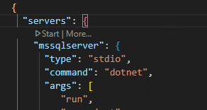
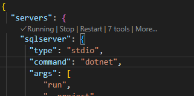

# Exercise 4.1: Using MCP Servers with GitHub Copilot

## Learning Objectives
By the end of this exercise, you will be able to:
- Install and configure an MCP (Model Context Protocol) server for SQL Server
- Use GitHub Copilot with MCP servers to query database tables
- Generate C# enumerations from database data using AI assistance
- Understand how MCP servers extend Copilot's capabilities beyond code generation

## Overview
Model Context Protocol (MCP) servers allow GitHub Copilot to interact with external systems like databases, APIs, and file systems. In this exercise, you'll install an MCP server for SQL Server and use it to query a Pokemon database table, then generate a C# enumeration from the results.

The code for an example SQL Server MCP server from Microsoft has already been pulled down from https://github.com/Azure-Samples/SQL-AI-samples into the exercises/4.1-mcp/mssql-mcp-dotnet folder.

## Prerequisites
- Visual Studio Code with GitHub Copilot extension installed
- SQL Server or SQL Server Express with sample Pokemon database
- .NET 8 SDK installed on your machine

## Exercise Steps

### Step 1: Add the MCP Server to your Workspace

1. In Visual Studio Code go to File > Open Folder and select the c:\Workshop\projects\pokedex folder.

    > This project is a basic React/.NET API web app that manages Pokemon and their trainers. We will use this project for future exercises, so feel free to explore the code base to get familiar with its structure.

1. Open the GitHub Copilot chat window (Ctrl-Shift-I) and make sure it is in ``Agent`` mode.

1. Create a .vscode/mcp.json file in your workspace.

1. Open the mcp.json file and add the following configuration:

   ```json
   {
     "servers": {
       "sqlserver": {
         "type": "stdio",
         "command": "dotnet",
         "args": [
            "run",
            "--project",
            "../../exercises/4.1-mcp/mssql-mcp-dotnet/MssqlMcp/MssqlMcp.csproj"
         ],
         "env": {
           "CONNECTION_STRING": "Server=(localdb)\\MSSQLLocalDB;Database=PokemonDB"
         }
       }
     }
   }
   ```

1. Note the structure of the file. An MCP server can be a command-line tool, a REST API, or any other type of executable that can process requests and return responses using the MCP protocol.

### Step 2: Start and Test the MCP Server

1. Save the Settings file, and then you should see the "Start" button appear in the settings file above the "sqlserver" line.  Click "Start" to start the MCP Server. (You can then click on "Running" to view the Output window).

    

1. Note that VS Code should have detected 7 tools available from the MCP server. This MCP server exposes tools like "ListTables", "DescribeTable", "CreateTable", "DropTable", "InsertData", "ReadData", and "UpdateData".

    

1. Start Chat (Ctrl+Shift+I), make sure Agent Mode is selected.

1. Ask Copilot to list all tables in the database 

    **Prompt to use:**
    ```
    List all tables in the database.
    ```

   If you have other tools loaded, you may need to specify "MSSQL MCP" in the initial prompt, e.g.:

    ```
    Using MSSQL MCP, list tables.
    ```

1. Copilot should use the MCP server to connect and show you the list of tables in the database.

### Step 3: Use the MCP Server to generate code

1. Start a new conversation with GitHub Copilot Chat.

1. Ask Copilot to show you the structure of the `PokemonType` table:

   **Prompt to use:**
   ```
   Using MSSQL MCP, show me the structure of the PokemonType table.
   ```

1. With the database results visible, ask Copilot to generate a C# enumeration:

   **Prompt to use:**
   ```
   Based on the PokemonType table data you just showed me, create a C# enumeration called PokemonType in the #Pokedex.Core/Models folder that includes all the types with their corresponding numeric values and XML documentation comments that include the descriptions.
   ```

1. Copilot should generate something like:
   ```csharp
   /// <summary>
   /// Represents the different types of Pokemon
   /// </summary>
   public enum PokemonType
   {
       /// <summary>
       /// Fire-type Pokemon are strong against Grass and Ice types
       /// </summary>
       Fire = 1,
       
       /// <summary>
       /// Water-type Pokemon are strong against Fire and Rock types
       /// </summary>
       Water = 2,
       
       /// <summary>
       /// Grass-type Pokemon are strong against Water and Rock types
       /// </summary>
       Grass = 3,
       
       // ... additional types
   }
   ```

1. Click ``Keep`` To save the generated code.

### Step 4. Use the MCP server to create test data

1. Start a new conversation with GitHub Copilot Chat.

1. Ask Copilot to display the schema of the pokemon table.

   **Prompt to use:**
   ```
   Using MSSQL MCP, show me the structure of the Pokemon table, including information on primary keys, foreign key relationships, and constraints.
   ```

1. In the same chat session, generate test data for the Pokemon table

   **Prompt to use:**
    ```
    Generate and insert test data for the Pokemon table. Look in the PokemonType table to assign types to the new Pokemon records. Create 20 new test records.
    ```

1. Click ``Continue`` when prompted to run the generated SQL script.

    > Note that some MCP tools may be dangerous to run without reviewing them, and by default the tool will be configured to require approval before running. The arrow next to the ``Continue`` button allows you to add this tool to the list of trusted tools for future use, which will allow them to run without prompting. **Use with caution on any actions that may be irreversible.**

1. Note that the generated SQL script may fail due to not recognizing that PokemonId is an auto-generated identity column. However, Copilot should be able to recognize the error and ask you if you want to insert identities or allow them to be generated.

   **Prompt to use:**
    ```
    Do not specify the PokemonId when inserting new records and allow the database to generate them.
    ```

1. Show the new records that were created

    **Prompt to use:**
    ```
    Show me the new records that were created in the Pokemon table. Include the type names in the result.
    ```

1. Note that using natural language Copilot was able to understand that it needed to join to the PokemonType table to get the type names.

    Also, the data it generated should, if not be perfectly accurate, be close enough to be useful for testing. For example, look at the names, descriptions, and types of pokemon and notice that they should match. Also, the distribution of Pokemon types should be reasonable.

## Key Concepts Demonstrated

- **MCP Integration**: How MCP servers extend GitHub Copilot's capabilities to interact with external systems
- **Prompting Techniques**: Crafting effective prompts to guide Copilot in using MCP data (e.g. first asking Copilot for the structure of a table, then asking it to generate code based on that structure).
- **Code Generation**: Converting external data into strongly-typed code constructs
- **Test Data Generation**: Creating realistic test data based on existing database schemas and relationships

## Troubleshooting

**MCP Server not appearing:**
- Verify the `mcp-config.json` file is in the correct location
- Check that the SQL Server connection string is correct
- Restart VS Code completely

**Database connection issues:**
- Ensure SQL Server is running and accessible
- Verify the connection string format and credentials
- Test the connection string with SQL Server Management Studio first

**Copilot not using MCP data:**
- Try being more specific in your prompts about querying the database
- Mention the table name and that you want to use the connected SQL Server
