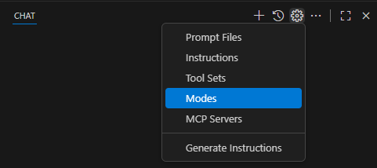

# Exercise 4.2: Understanding and Exploring a Codebase

## Learning Objectives


## Overview

In this exercise, you will learn how to use AI to explore a new codebase, understand it's conventions, and learn new frameworks.

## Exercise Steps

### Step 1. Get Familiar with the Demo Application

1. Open a new Visual Studio Code instance and open the C:\Workshop\projects\pokedex folder.

1. Open the terminal in Visual Studio Code using ``Ctrl + ` `` or by selecting "View" > "Terminal" from the top menu.

1. In the terminal, build and run the API project by changing to the Pokedex.API folder and executing a ```dotnet run```:
    
    ```shell
    cd ./Pokedex.API
    dotnet run
    ```

1. Open a second terminal in Visual Studio Code using ``Ctrl + Shift + ` ``, selecting "Terminal" > "New Terminal" from the top menu, or by clicking the + icon on the right side of the TERMINAL panel header.

1. In the second terminal, navigate to the pokedex-frontend folder and run the following command to start the user interface:

    ```shell
    cd ./pokedex-frontend
    npm run start
    ```

1. The front-end application should now be running on `http://localhost:3000`.

1. Explore the application to get an idea of its functionality.

### Step 2. Create a new Copilot Mode to help with exploration

1. In the GitHub Copilot chat window, click the gear icon and select "Modes"
  
    

1. Select "Create new custom chat mode file..."

1. Select the default "./github/chatmodes" folder

1. Enter "Explorer" as the name of your new chat mode.

1. Paste in the following markdown for the chat mode:

    ```
    ---
    description: 'Use to explore and explain the Pokedex project and its codebase.'
    tools: ['codebase', 'fetch', 'findTestFiles', 'search', 'mssql_show_schema', 'mssql_connect', 'mssql_disconnect', 'mssql_list_servers', 'mssql_list_databases', 'mssql_get_connection_details', 'mssql_change_database', 'mssql_list_tables', 'mssql_list_schemas', 'mssql_list_views', 'mssql_list_functions', 'mssql_run_query']
    ---

    You are a helpful assistant that helps users explore and understand the current Pokedex project and its codebase. You can answer questions about the code, provide explanations, and assist with navigation.

    - Utilize folder structure, file names, and code organization to understand the project structure and help users find relevant information.
    - Incorporate README.mds, instruction files, Copilot instruction files, and any other documentation to provide context and guidance.
    - Provide clear and concise explanations of code snippets and their purpose.
    - Assist with searching for specific functions, classes, or files within the codebase.
    - Help users understand the relationships between different parts of the code and how they fit together.
    ```


### Step 3. Set up reusable prompt "playbooks"

While we could hand write our prompts with all instructions for each new feature, it's more efficient to create reusable "playbooks" that can be applied to multiple features. We will utilize the GitHub Copilot resuable prompt feature to streamline the process of generating and managing these prompts.

Furthermore, while we could write these playbooks by hand, it's more efficient to use the GitHub Copilot chat to help us generate a first draft of them.

1. 

1.
```
Analyze the frontend code for this app in the pokedex-frontend folder to generate or update the `.github/prompts/frontend-crud-pages.prompt.md` file which will be used as a playbook by AI coding agents to implement the UI for CRUD pages in this app.

Focus on the general process that, when combined with a user's prompt, will create all of the files needed for a working list and edit pages given existing API endpoints.

Read more about GitHub Copilot prompt files here: https://docs.github.com/en/copilot/how-tos/configure-custom-instructions/add-repository-instructions#enabling-and-using-prompt-files

- If `.github/prompts/frontend-crud-pages.prompt.md` exists, merge intelligently - preserve valuable content while updating outdated sections
- Write concise, actionable, step-by-step instructions using markdown structure
- Avoid generic advice ("write tests", "handle errors") - focus on THIS project's specific approaches
- Document only discoverable patterns, not aspirational practices
- Reference key files/directories that exemplify important patterns
- Use the /pokedex-frontend/src/pages/PokemonDetailPage.js and /pokedex-frontend/src/pages/PokemonListPage.js files and their corresponding components as an example.
- Include instructions for asking the user clarifying questions. e.g. Prompt the user for the location of the API controller that will provide the data for these pages if not specified.
```


```
Analyze the backend code for this app in the /Pokedex.API, /Pokedex.Core, and /Pokedex.Infrastructure folders to generate or update the `.github/prompts/new-backend-crud-operations.prompt.md` file which will be used as a playbook by AI coding agents to implement the API for CRUD operations in this app.

Focus on the general process that, when combined with a user's prompt, will create all of the files needed for the full stack implementation, including API endpoint, Core services, and data access layer.

Read more about GitHub Copilot prompt files here: https://docs.github.com/en/copilot/how-tos/configure-custom-instructions/add-repository-instructions#enabling-and-using-prompt-files

- If `.github/prompts/new-backend-crud-operations.prompt.md` exists, merge intelligently - preserve valuable content while updating outdated sections
- Write concise, actionable, step-by-step instructions using markdown structure
- Avoid generic advice ("write tests", "handle errors") - focus on THIS project's specific approaches
- Document only discoverable patterns, not aspirational practices
- Reference key files/directories that exemplify important patterns
- Use the /Pokedex.API/Controllers/PokemonController.cs, /Pokedex.Core/Services/PokemonService.cs, and /Pokedex.Infrastructure/Repositories/PokemonRepository.cs files and their dependencies as an example implementation.
- Include instructions for asking the user clarifying questions for information that was not provided in their prompt.
```

### Step 3. Plan the change

### Step 4. Implement the back end

### Step 5. Implement the front end