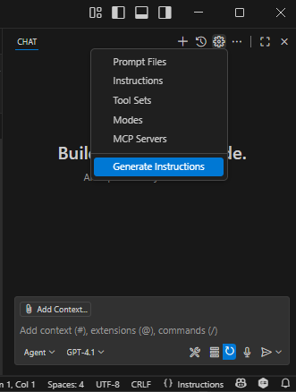
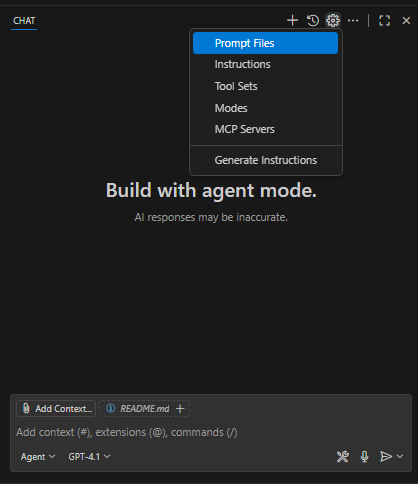

# Exercise 5.1: Building Features with AI

## Learning Objectives

- Understand how to leverage AI to build features in an existing codebase.
- Gain hands-on experience with AI-assisted development.
- Practice AI-first development workflows.

## Overview

In this exercise, you will work with a simple demo application to build a new feature using AI. 

## Exercise Steps

### Step 1. Get Familiar with the Demo Application

1. Open a new Visual Studio Code instance and open the C:\Workshop\projects\pokedex folder.

1. Open the terminal in Visual Studio Code using ``Ctrl + ` `` or by selecting "View" > "Terminal" from the top menu.

1. In the terminal, build and run the API project by changing to the Pokedex.API folder and executing a ```dotnet run```:
    
    ```shell
    cd ./Pokedex.API
    dotnet run
    ```

1. Open a second terminal in Visual Studio Code using ``Ctrl + Shift + ` ``, selecting "Terminal" > "New Terminal" from the top menu, or by clicking the + icon on the right side of the TERMINAL panel header.

1. In the second terminal, navigate to the pokedex-frontend folder and run the following command to start the user interface:

    ```shell
    cd ./pokedex-frontend
    npm run start
    ```

1. The front-end application should now be running on `http://localhost:3000`.

1. Explore the application to get an idea of its functionality.

### Step 2. Set up Copilot instructions

1. In the GitHub Copilot chat window, click the gear icon and select "Generate Instructions"
  
    
  
    Copilot will review your code and auto-generate a standard copilot-instructions.md in the ./github folder of your project. While it is working, take time to read the prompt that is used to generate the instructions file. These built in prompts have had significant prompt engineering effort put into them to make them effective.

1. Click "Keep" to save the generated file.

### Step 3. Set up reusable prompt "playbooks"

While we could hand write our prompts with all instructions for each new feature, it's more efficient to create reusable "playbooks" that can be applied to multiple features. We will utilize the GitHub Copilot resuable prompt feature to streamline the process of generating and managing these prompts.

Furthermore, while we could write these playbooks by hand, it's more efficient to use the GitHub Copilot chat to help us generate a first draft of them.

1. In the GitHub Copilot chat window, click the gear icon and select "Prompt Files"



1. Start a new chat session and enter the following prompt:

    ```
    Analyze the frontend code for this app in the pokedex-frontend folder to generate or update the Github Copilot prompt file `.github/prompts/frontend-feature.prompt.md` which will be used as a playbook by AI coding agents to implement the UI for CRUD pages in this app including the pages, components, redux updates, and API calls.

    Focus on the general process that, when combined with a user's prompt, will create all of the files needed for a working list and edit pages given existing API endpoints.

    Read more about GitHub Copilot prompt files here: https://docs.github.com/en/copilot/how-tos/configure-custom-instructions/add-repository-instructions#enabling-and-using-prompt-files

    - If `.github/prompts/frontend-feature.prompt.md` exists, merge intelligently - preserve valuable content while updating outdated sections
    - Write concise, actionable, step-by-step instructions using markdown structure
    - Avoid generic advice ("write tests", "handle errors") - focus on THIS project's specific approaches
    - Document only discoverable patterns, not aspirational practices
    - Reference key files/directories that exemplify important patterns
    - Use the /pokedex-frontend/src/pages/PokemonListPage.js, /pokedex-frontend/src/pages/PokemonEditPage.js, and /pokedex-frontend/src/pages/PokemonCreatePage.js files and their corresponding components as an example.
    - Include instructions for asking the user clarifying questions. e.g. Prompt the user for the location of the API controller that will provide the data for these pages if not specified.
    ```

1. In the generated frontend-feature.prompt.md file, make sure the generated prompt file has the following header as the first three lines:
    ```
    ---
    mode: agent
    ---

1. Review the playbook generated by GitHub Copilot.

1. Start a new chat session and enter the following prompt:

    ```
    Analyze the backend code for this app in the /Pokedex.API, /Pokedex.Core, and /Pokedex.Infrastructure folders to generate or update the GitHub Copilot prompt file `.github/prompts/backend-feature.prompt.md` file which will be used as a playbook by AI coding agents to implement the API for CRUD operations in this app including the models, services, Entity Framework configuration, repositories, and API endpoints.

    Focus on the general process that, when combined with a user's prompt, will create all of the files needed for the full stack implementation, including API endpoint, Core services, and data access layer.

    Read more about GitHub Copilot prompt files here: https://docs.github.com/en/copilot/how-tos/configure-custom-instructions/add-repository-instructions#enabling-and-using-prompt-files

    - If `.github/prompts/backend-feature.prompt.md` exists, merge intelligently - preserve valuable content while updating outdated sections
    - Write concise, actionable, step-by-step instructions using markdown structure
    - Avoid generic advice ("write tests", "handle errors") - focus on THIS project's specific approaches
    - Document only discoverable patterns, not aspirational practices
    - Reference key files/directories that exemplify important patterns
    - Use the /Pokedex.API/Controllers/PokemonController.cs, /Pokedex.Core/Services/PokemonService.cs, and /Pokedex.Infrastructure/Repositories/PokemonRepository.cs files and their dependencies as an example implementation.
    - Include instructions for asking the user clarifying questions for information that was not provided in their prompt.
    ```

1. In the generated backend-feature.prompt.md file, make sure the generated prompt file has the following header as the first three lines:

    ```
    ---
    mode: agent
    ---

1. Review the playbook generated by GitHub Copilot.

### Step 3. Plan the change

1. Start a new chat session. Make sure the mode is ``Agent``, and enter the following prompt:

    ```
    Generate a design and plan for implementing a new "capture" full-stack feature which ties trainers to the pokemon they have captured.

    - Propose a data model for a trainer capturing a Pokemon.
    - Describe the API endpoints needed for this feature.
    - Outline the front-end components required to support this feature.
    - Consider any edge cases and nice-to-have features.
    - Ask clarifying questions.

    Do NOT write any code yet. Only create the design and implementation plan.
    ```

1. Review the proposed design. If there are any changes you would like to make, have a conversation with the AI to refine the plan.

### Step 4. Implement the feature

1. In the same chat session tell the AI to generate the necessary code for the back end implementation.

    Click the ``Add Context`` button and select the #backend-feature.prompt.md file.

    Prompt:
    ```
    Implement the API for the new capture feature (API, Core and Infrastructure layers).
    ```

1. In the same chat session tell the AI to generate the necessary code for the frontend.

    Click the ``Add Context`` button and select the #frontend-feature.prompt.md file.

    Prompt:
    ```
    Implement the user interface for the new capture feature.
    ```

### Step 6. Test the implementation

1. Test the new feature in the running application at `http://localhost:3000`.

1. Verify that the user interface behaves as expected and that the new feature is fully functional. Did it implement it how you expected?

    If there are any issues, attempt to debug and fix the issues using Copilot.

    Could any of these issues have been avoided with better planning, design, or prompting?

## Summary

In this exercise, we implemented a new "capture" feature that ties trainers to the Pokémon they have captured. The implementation involved both backend and frontend changes.

### Key Points

- The backend implementation included the creation of API endpoints, Core services, and Infrastructure components to support the new feature.
- The frontend implementation involved creating user interface components that allow users to interact with the capture feature.
- Thorough testing was conducted to ensure the feature works as intended and meets user expectations.

### Reflection

- The implementation process highlighted the importance of clear planning and design before diving into coding.
- Future improvements could include more detailed user stories, acceptance criteria, and test plans/unit tests to guide development.